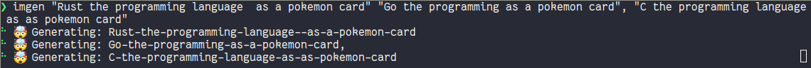

# imgen



A cli wrapper around OpenAI imgage generation that works for me.
Give multiple prompts and request them concurrently.

Install

```
cargo install imgen
```

# Run

```
imgen "First prompt" "Second prompt"
```

if a prompt is `.` is will reuse the previous prompt. So the create 3 variations run:

```
imgen "prompt" . .
```
